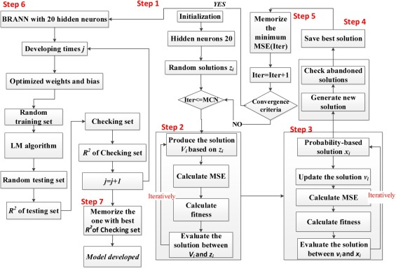

ABC-BRANN
=========
Paper is available on https://doi.org/10.1016/j.psep.2019.05.046

### Intorduction

**ABC-BRANN** is a time-series hybird approach for estimating the flammable cloud volumes and dimensions in a congested offshore setting. This approach is composed of the Artificial bee colony optimization algorithm (ABC) and the Bayesian Regularization Artificial Neural Network (BRANN), in which the former optimizes the latter neural network weight parameters to improve the prediction accuracy of flammable cloud difffusion. 

### ABC-BRANN Architecture

	

</a>.

### Approach comparison 
<table>
<tr>
    <th rowspan="2"> Approach</th>
    <th colspan="2">Group1</th>
    <th colspan="2">Group2</th>
    <th colspan="2">Group3</th>
    <th colspan="2">Group4</th>
      
</tr>
<tr>
    <td>R2 of DS</td>
    <td>R2 of CS</td>
    <td>R2 of DS</td>
    <td>R2 of CS</td>
    <td>R2 of DS</td>
    <td>R2 of CS</td>
    <td>R2 of DS</td>
    <td>R2 of CS</td>
</tr>
<tr>
    <td>ABC-BRANN</td>
    <td>0.9900</td>
    <td>0.9631</td>
    <td>0.9901</td>
    <td>0.9135</td>
    <td>0.9978</td>
    <td>0.9871</td>
    <td>0.9967</td>
    <td>0.9885</td>
</tr>

<tr>
    <td>PSO-BRANN</td>
    <td>0.9956</td>
    <td>0.9495</td>
    <td>0.9877</td>
    <td>0.8926</td>
    <td>0.9985</td>
    <td>0.9857</td>
    <td>0.9975</td>
    <td>0.9845</td>
</tr>
<tr>
    <td>BRANN</td>
    <td>0.9988</td>
    <td>0.9034</td>
    <td>0.9864</td>
    <td>0.9052</td>
    <td>0.9981</td>
    <td>0.9739</td>
    <td>0.9969</td>
    <td>0.9824</td>
</tr>
</table>
